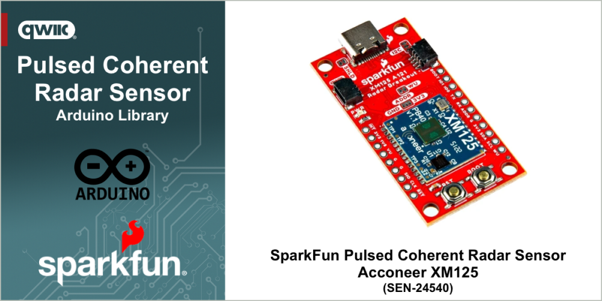

# SparkFun Pulsed Coherent Radar Sensor – Acconeer XM125

Arduino Library for the SparkFun Pulsed Coherent Radar Sensor 

https://github.com/sparkfun/SparkFun_Qwiic_XM125_Arduino_Library

The [SparkFun Qwiic Soil Moisture Sensor (SEN-17731)](https://www.sparkfun.com/sparkfun-qwiic-soil-moisture-sensor.html) is a simple breakout for measuring the moisture in soil and similar materials. The soil moisture sensor is pretty straightforward to use. The two large, exposed pads function as probes for the sensor, together acting as a variable resistor. The more water that is in the soil means the better the conductivity between the pads will be, resulting in a lower resistance and a higher SIG out. 

Looking for the board that matches this library - pick up a [SparkFun Qwiic Soil Moisture Sensor (SEN-17731)](https://www.sparkfun.com/sparkfun-qwiic-soil-moisture-sensor.html) at www.sparkfun.com.

SparkFun XM125 A121 Arduino Library
========================================

[*SparkFun Pulsed Coherent Radar Sensor – Acconeer XM125 (Qwiic) (SEN-24540)*](https://www.sparkfun.com/products/24540)

This is the SparkFun library for the Acconeer Entry+ Module XM125 with the A121 60GHz Pulsed Coherent Radar sensor and I2C interface.

Repository Contents
-------------------

* **/examples** - Example sketches for the library (.ino). Run these from the Arduino IDE.
* **/src** - Source files for the library (.cpp, .h).
* **/Documentation** - Datasheet and application note for the XM125 and A121.
* **keywords.txt** - Keywords from this library that will be highlighted in the Arduino IDE.
* **library.properties** - General library properties for the Arduino package manager.
* **[CONTRIBUTING.md](./CONTRIBUTING.md)** - guidance on how to contribute to this library.

Documentation
--------------

* **[Installing an Arduino Library Guide](https://learn.sparkfun.com/tutorials/installing-an-arduino-library)** - Basic information on how to install an Arduino library.
* **[Hookup Guide](https://docs.sparkfun.com/SparkFun_Qwiic_Pulsed_Radar_Sensor_XM125)** - Basic hookup guide for the SparkFUn Qwiic Pulsed Coherent Radar Sensor - XM125.
* **[Product Repository](https://github.com/sparkfun/SparkFun_Qwiic_Pulsed_Radar_Sensor_XM125)** - Main repository for the SparkFun Qwiic XM125 (including hardware files)

Products that use this Library 
---------------------------------

* [*SEN-24540*](https://www.sparkfun.com/products/24540)

License Information
-------------------

This product is _**open source**_! 

Please review the LICENSE.md file for license information. 

If you have any questions or concerns on licensing, please contact technical support on our [SparkFun forums](https://forum.sparkfun.com/viewforum.php?f=152).

Distributed as-is; no warranty is given.

- Your friends at SparkFun.

_<COLLABORATION CREDIT>_
